# PR: logo-grounded light and dark conversation themes

## Summary

This change replaces the olive/lime dark-only interface with two muted, logo-derived themes.
The before captures come from commit `abbfcc5`; the after captures come from the change head.
Both sets drive the exported application through the real bridge-backed Playwright fixture.

The old application ignored the operating-system color preference, so its light-preference
captures intentionally show the same dark-only palette. The after captures demonstrate the new
persisted light and dark modes. Focus captures retain keyboard focus instead of blurring the
active control before the screenshot.

## Light theme

| View | Before | After |
| --- | --- | --- |
| Conversation list | 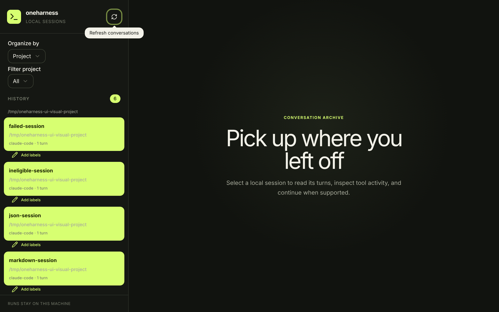 | 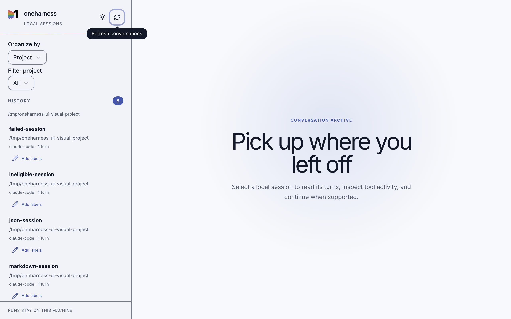 |
| Message and code | 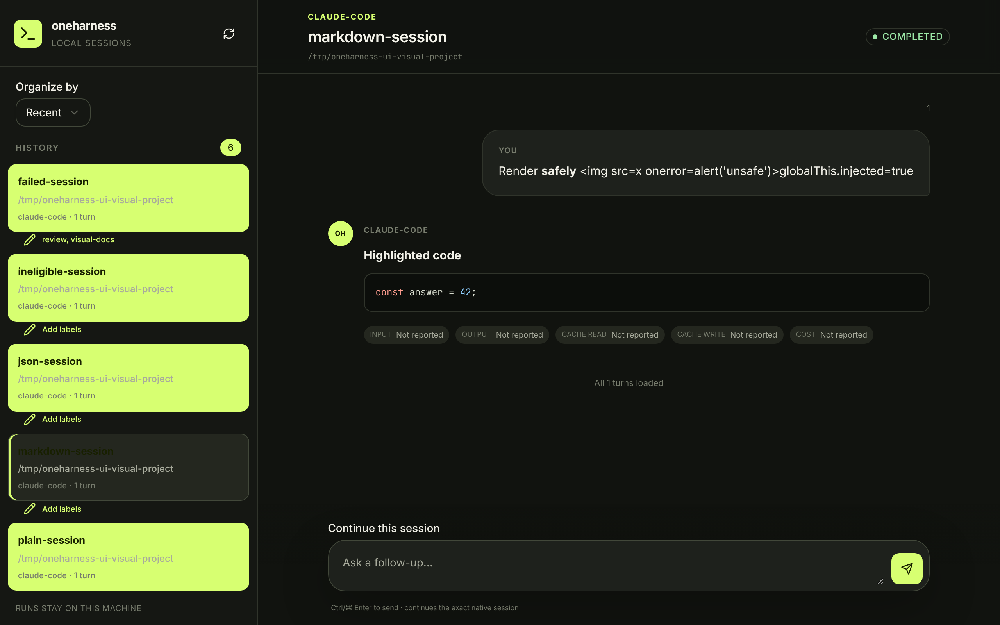 | 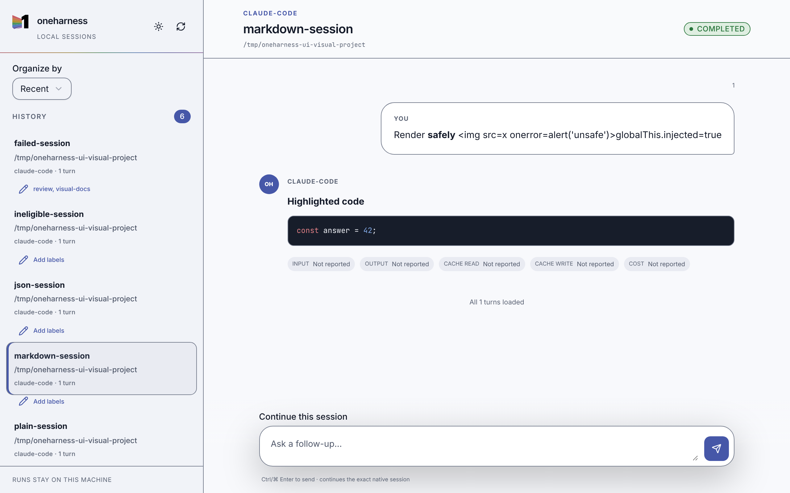 |
| Reply form with keyboard focus |  | 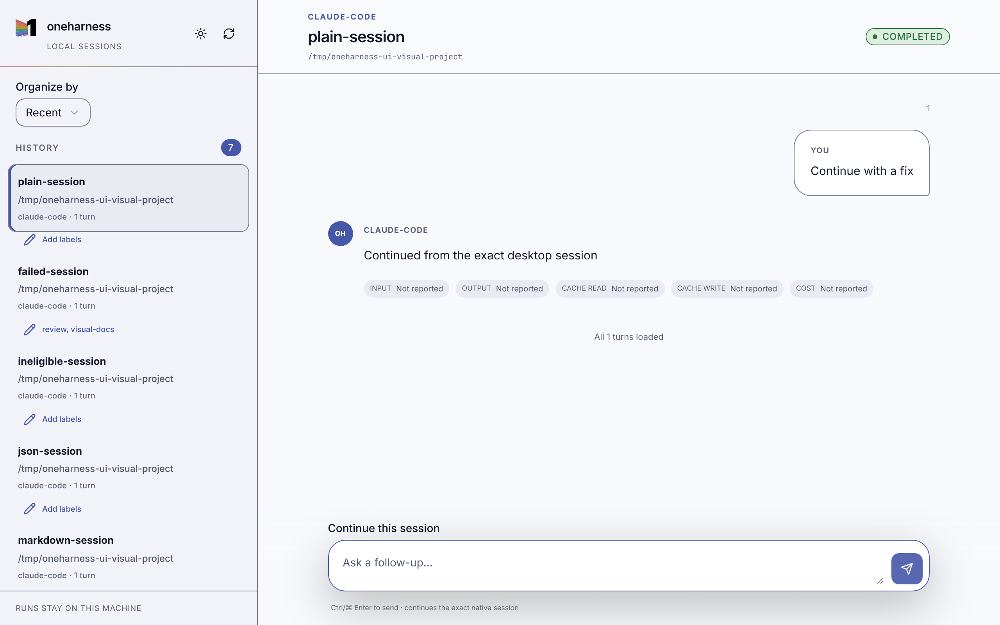 |
| Label dialog |  | 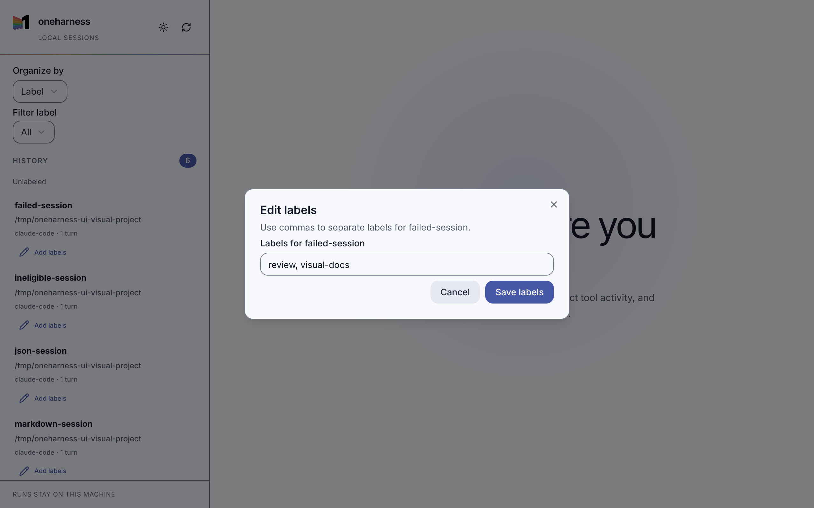 |

## Dark theme

| View | Before | After |
| --- | --- | --- |
| Conversation list |  | 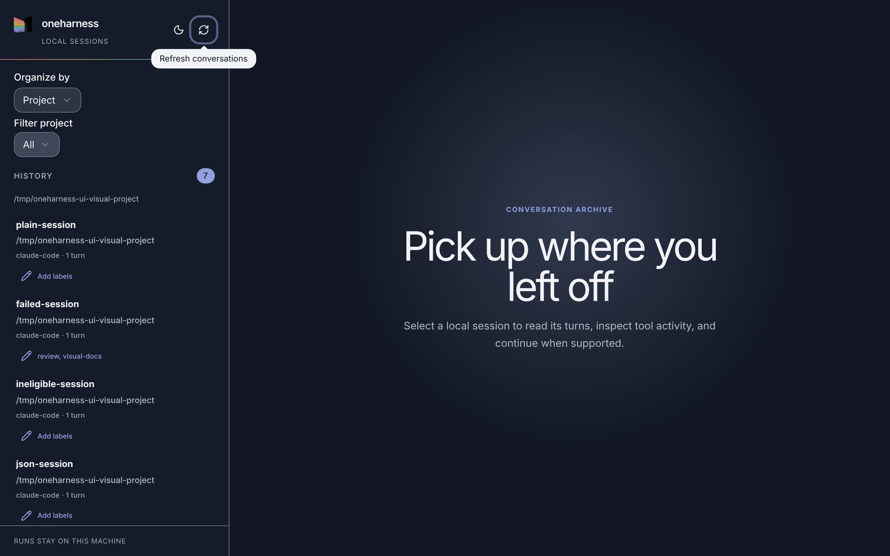 |
| Message and code | 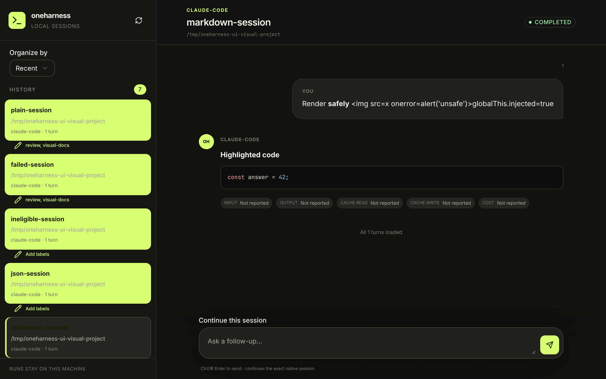 | 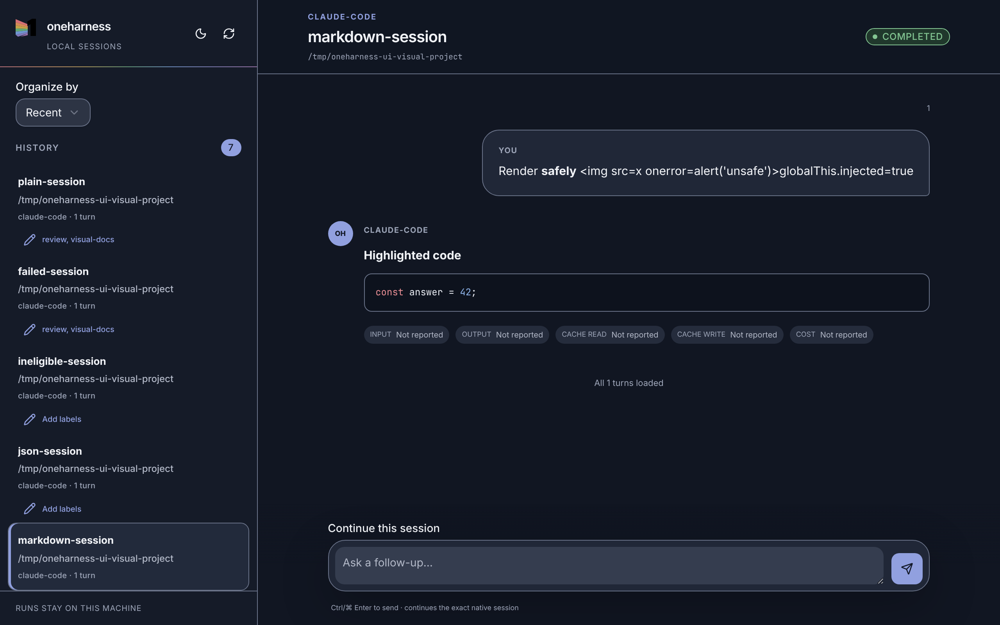 |
| Reply form with keyboard focus | 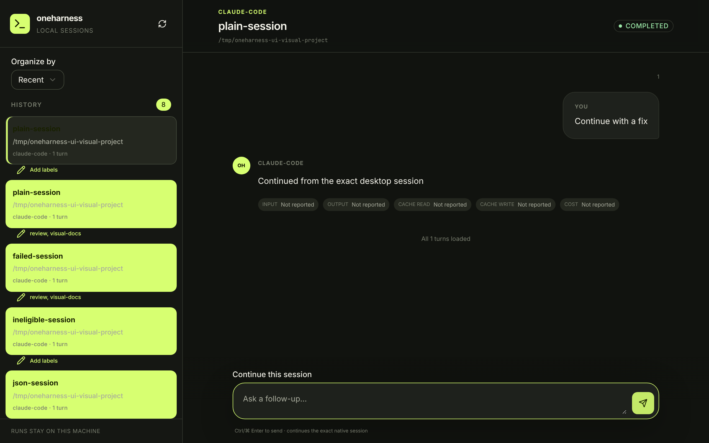 | 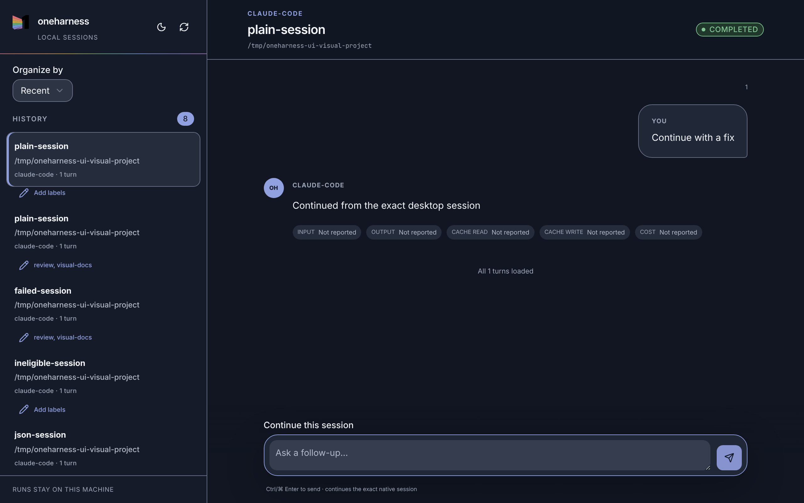 |
| Label dialog | 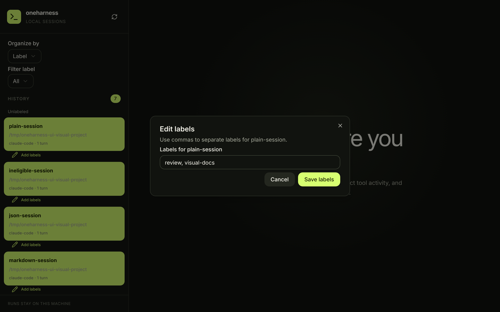 | 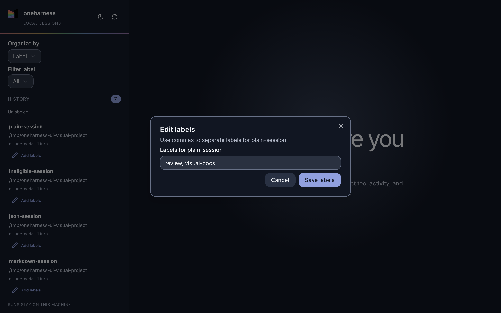 |

## WCAG 2.1 contrast

Ratios use WCAG relative luminance. Text pairings meet or exceed 4.5:1, and component
boundaries meet or exceed 3:1. Semantic foregrounds are measured against their dedicated
surfaces.

| Pair | Light | Dark |
| --- | ---: | ---: |
| foreground / background | 16.66 | 16.27 |
| card foreground / card | 17.54 | 14.99 |
| popover foreground / popover | 17.54 | 13.44 |
| primary foreground / primary | 6.58 | 6.93 |
| secondary foreground / secondary | 12.02 | 11.71 |
| muted foreground / muted | 5.99 | 7.03 |
| accent foreground / accent | 11.70 | 10.40 |
| destructive / destructive surface | 5.00 | 5.81 |
| success / success surface | 4.72 | 6.23 |
| warning / warning surface | 4.98 | 6.80 |
| info / info surface | 5.11 | 5.96 |
| border / background | 4.03 | 3.70 |
| input / card | 4.24 | 3.41 |
| ring / background | 6.25 | 8.10 |
| subtle / background | 5.64 | 7.32 |
| code foreground / code | 14.79 | 15.55 |

## Verification

- `bun run --cwd apps/conversation-ui playwright test --config visual.playwright.config.ts`
  captures the real exported UI and bridge fixture.
- `just test-e2e` drives theme persistence and the conversation workflows through accessible
  roles, labels, and keyboard focus.
- `just gate` runs the complete deterministic pre-push gate.
